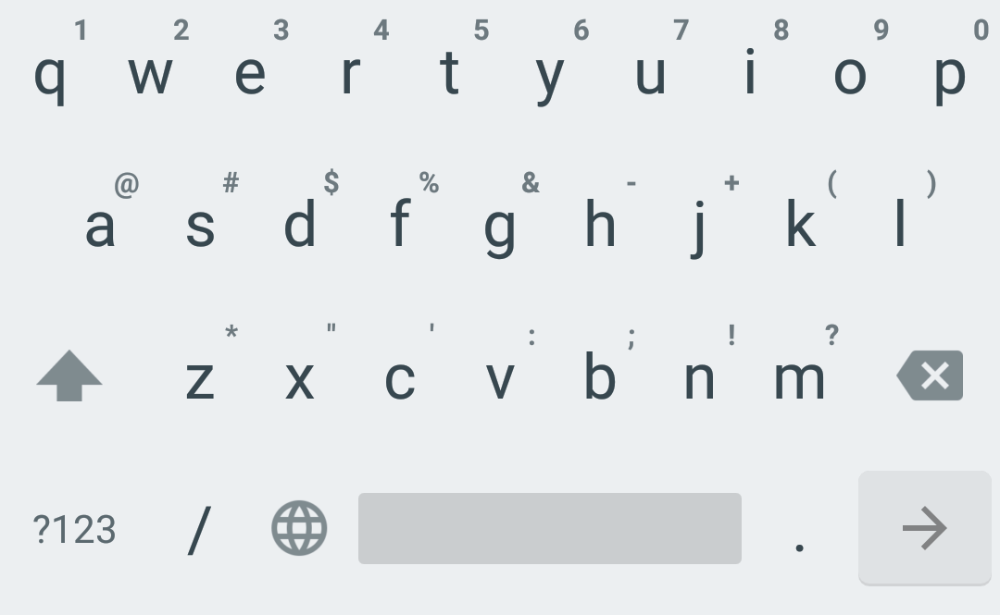

# Simple Keyboard

      
## About

Features:
- Small size (<1MB)
- Adjustable keyboard height for more screen space
- Number row
- Swipe space to move pointer
- Delete swipe
- Custom theme colors
- Minimal permissions (only Vibrate)
- Ads-free

Feature it doesn't have and probably will never have:
- Emojis
- GIFs
- Spell checker
- Swipe typing

## Downloads

## Credits

Licensed under Apache License Version 2

This keyboard is based on AOSP LatinIME keyboard. You can get the original source code in https://android.googlesource.com/platform/packages/inputmethods/LatinIME/
